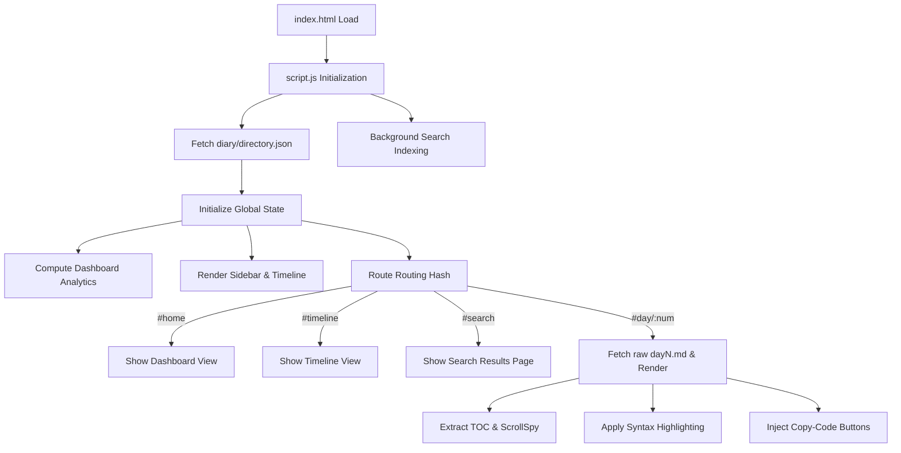

# 🧠 TRCS102 – Diary Dashboard (DD) Technical Architecture & System Design

This document details the complete underlying logic, architecture, and client-side systems of the **TRCS102 – Agentic AI Training Diary Dashboard (DD)** application. 

---

## 🏗️ 1. System Overview

The Diary Dashboard (DD) is a modern, responsive, high-performance, and client-side single-page application (SPA). It serves as an interactive learning log database. The project is designed with a **glassmorphic design language** using Vanilla CSS, Vanilla JavaScript, and lightweight helper libraries (`Marked.js`, `Highlight.js`, and `Lucide Icons`). 

### 📐 High-Level Architecture Flow



---

## 💾 2. Global Application State (`window.diaryState`)

The entire application runs as a state-driven client-side application. The memory footprint is stored inside a single global namespace:

```javascript
window.diaryState = {
    entries: [],          // Sorted list of day entries metadata parsed from directory.json
    contentCache: {},     // Key-value cache of raw markdown text: { 'day1.md': '...' }
    wordsCache: {},       // Cache mapping filenames to word counts: { 'day1.md': 1186 }
    currentDay: null,     // Active day integer when in the Reader view
    activeTheme: 'dark',  // Theme state: 'dark' or 'light'
    previousHash: '',     // Track history hash updates
    isInitialLoad: true   // Block loader transition animations on page initialization
};
```

---

## 🚥 3. Client-Side Router (`handleRouting`)

Routing is performed purely on the client side by listening to the window's `hashchange` events:

```javascript
window.addEventListener('hashchange', handleRouting);
```

### Route Mappings

| Hash URL Pattern | Routing Handler | Target View DOM Element | Description |
| :--- | :--- | :--- | :--- |
| `#home`, `#/home`, ``, `#` | `handleRouting()` | `els.viewHome` | Renders the primary dashboard statistics and about profile. |
| `#timeline`, `#/timeline` | `handleRouting()` | `els.viewTimeline` | Renders the interactive milestone logs vertical card timeline. |
| `#/search?q=...` | `executeSearch(query)` | `els.viewSearch` | Decodes query terms, executes search scoring, and displays cards. |
| `#/day/:num` | `loadAndRenderDay(num)` | `els.viewReader` | Fetches, parses, alerts-preprocesses, and renders the log file. |

### View Transitions
During view changes, the router invokes `triggerTransitionLoader(callback)`. This reveals the full-page loader, executes the rendering logic inside a micro-task callback, and hides the loader after a short CSS delay to provide a premium web app feel.

---

## 📊 4. Static Indexing & Analytics Engine

Rather than scanning the filesystem at runtime (which is restricted by client-side browser sandboxing), the application relies on `diary/directory.json` as a pre-compiled metadata index.

### 📝 Directory Schema
```json
[
  {
    "day": 15,
    "file": "day15.md",
    "title": "Building an Agentic Task Management Chatbot using Streamlit and MongoDB",
    "date": "2026-07-14",
    "tags": ["Streamlit", "MongoDB", "Agentic AI", "Chatbot", "Session State", "CRUD", "Task Management"],
    "summary": "Developed a conversational task management application using Streamlit...",
    "wordCount": 6221
  }
]
```

### 📈 Dashboard Computations
Upon initialization (`calculateAnalytics`), the app loops through `window.diaryState.entries` to dynamically calculate:
1. **Completion Ratio:** `(entries.length / 30) * 100` (computed against the 30-day course program).
2. **Total Words Written:** Cumulative sum of `wordCount` across all entry objects.
3. **Estimated Reading Time:** `Total Words / 200` (assuming average reading speed of 200 words per minute).
4. **Longest Entry:** Determines the log file containing the largest word count value.
5. **Latest Log Details:** Renders the details from the final index element in `entries`.

---

## 📝 5. Markdown Fetching & Rendering Engine

When a user opens a specific day, the application fetches the raw Markdown file over HTTP:

1. **Caching Layer Check:** Checks if `window.diaryState.contentCache['dayN.md']` is populated. If yes, it retrieves the Markdown content from memory. If not, it initiates an asynchronous `fetch()` query.
2. **Front Matter Stripping:** Extracts metadata comments `<!-- ... -->` or `--- ... ---` at the top of the file to ignore them during parsing and word counting.
3. **GitHub-Style Alert Parsing:** Before sending the content to the Markdown parser, `preprocessAlerts()` scans the lines. It checks blockquotes (`>`) starting with `[!NOTE]`, `[!WARNING]`, `[!TIP]`, `[!IMPORTANT]`, or `[!CAUTION]` and prefixes/decorates them with corresponding CSS Alert Classes (`alert-note`, `alert-warning`, etc.) for beautiful glassmorphic formatting.
4. **HTML Generation:** The raw content is parsed into semantic HTML via `Marked.js`.
5. **Code Highlighting & Interactivity:** 
   - `Highlight.js` highlights Python/Bash script syntaxes.
   - Inject a custom language label (`python`, `bash`, `javascript`) inside a code-block header.
   - Inject a dynamic copy button that copies the code block contents to the user's clipboard using the `navigator.clipboard.writeText` API, updating its label to "Copied!" for 2 seconds.

---

## 📑 6. Table of Contents & ScrollSpy

To improve reading navigability, logs that contain **at least 3 headings** (`H2` or `H3`) trigger the creation of a Table of Contents (TOC).

### Header Processing
1. Header tags are queried: `headings = markdownContainer.querySelectorAll('h2, h3')`.
2. Header strings are slugified to make unique anchor IDs:
   ```javascript
   const slug = heading.textContent.toLowerCase()
       .replace(/[^a-z0-9\s-]/g, '')
       .replace(/\s+/g, '-');
   heading.id = `${slug}-${index}`;
   ```
3. A sidebar link `<a href="#slug-index">` is created. `H3` items receive `indent-2` padding.

### ScrollSpy Mechanism
An event listener is hooked to the main content container's scroll stream:
```javascript
activeScrollSpyHandler = () => {
    // Finds the last heading whose top position is <= 80px relative to the viewport.
    // Adds class "active" to the corresponding TOC link, removing it from others.
};
```
Clicking any TOC link triggers a smooth CSS vertical offset scroll (`scrollToAnchor`) leaving a `24px` top margin.

---

## 🔍 7. Real-Time Search & Autocomplete Engine

The search system operates completely on client-side cached data without hitting any backend APIs:

### 🧵 Background Pre-Indexing
To ensure search queries match the full-text content of the logs immediately (without waiting for the user to visit every page first), a background indexing daemon runs:
- Loop through all entries.
- If not cached, it triggers a background fetch to get the file's raw markdown and caches it in `contentCache`.
- Sleeps for `300ms` between requests using an asynchronous `setTimeout` wrapper to prevent browser main-thread blocking or frame drops.

### 💡 Autocomplete Recommendations
As the user types into the search field, matching suggestions are ranked using weight variables:
* **Title Match:** +50 Score
* **Tag Match:** +30 Score
* **Body Content Match:** +10 Score

Matches are sorted by score descending, and the top results are displayed as a dropdown list.

### 🔎 Search Results Page
Pressing enter loads the `#/search?q=query` route. It displays structured cards showing:
* **Relevance Rank:** Scoring factors in title matches, tag matches, and the number of occurrences of the term in the document body (+2 per occurrence).
* **Highlighted Snippet:** Extracts a substring context surrounding the first occurrence of the search query (50 characters before, 90 characters after). It cleans Markdown syntax characters and wraps the query string in a CSS `<mark>` tag.

---

## 🎨 8. Theme Logic & CSS Design System

The app utilizes CSS Variables (custom properties) to provide dark/light options dynamically.

```css
:root[data-theme="dark"] {
    --bg-primary: #0a0b10;
    --bg-glass: rgba(16, 18, 27, 0.45);
    --border-glass: rgba(255, 255, 255, 0.08);
    --text-primary: #f3f4f6;
    --color-accent: #8b5cf6; /* Vibrant violet */
}

:root[data-theme="light"] {
    --bg-primary: #f8fafc;
    --bg-glass: rgba(255, 255, 255, 0.65);
    --border-glass: rgba(0, 0, 0, 0.06);
    --text-primary: #0f172a;
    --color-accent: #6d28d9; /* Deep violet */
}
```

* **Storage:** User selection is saved to browser storage via `localStorage.setItem('theme', theme)`.
* **Application:** Applies the attribute `data-theme="dark"|"light"` to the root `<html>` element on load, instantly adapting layout coloring tokens.
