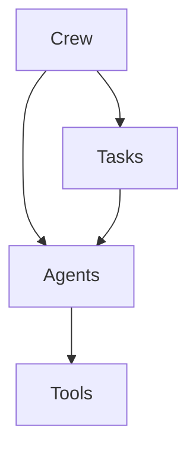

# Day 3: Building Autonomous Agents with CrewAI

On Day 3, we stepped up from basic LLM prompts to **Multi-Agent Systems**. We explored **CrewAI**, a framework designed to enable multiple AI agents to collaborate, share memory, assign tasks, and execute complex workflows.

---

## 👥 Core Concepts in CrewAI

A CrewAI implementation consists of four primary building blocks:



1. **Agents:** Specialized personas (e.g., Researcher, Writer) with custom prompts, backstories, and tools.
2. **Tasks:** Clear, actionable directives assigned to specific agents.
3. **Tools:** Utilities (e.g., WebSearchTool, DirectoryReader) that agents invoke to complete their tasks.
4. **Crew:** The orchestration layer that coordinates how agents execute tasks (sequential or hierarchical).

---

## 🛠️ Installation and Configuration

To get started, we installed `crewai` and `crewai-tools`:

```bash
pip install crewai crewai-tools
```

We also configured `LiteLLM` to manage different model providers (OpenAI, Anthropic, Ollama) uniformly.

---

## 💻 Building a Research and Writing Crew

We built a crew consisting of two agents:
- **Research Specialist:** Find recent updates on a given topic.
- **Technical Writer:** Refine the raw updates into a professional markdown blog post.

Here is the complete implementation script:

```python
import os
from crewai import Agent, Task, Crew, Process
from crewai_tools import SerperDevTool
from dotenv import load_dotenv

load_dotenv()

# Setup Web Search Tool (requires SERPER_API_KEY)
search_tool = SerperDevTool()

# 1. Define Agents
researcher = Agent(
    role="Senior Research Analyst",
    goal="Uncover cutting-edge developments in AI and technology.",
    backstory="You are a seasoned analyst with an eye for detail. You excel at separating hype from real technological breakthroughs.",
    tools=[search_tool],
    verbose=True,
    memory=True
)

writer = Agent(
    role="Technical Content Editor",
    goal="Create engaging, clean technical articles for a developer audience.",
    backstory="You are a clear-thinking communicator who can explain complex computational concepts in a reader-friendly format.",
    verbose=True
)

# 2. Define Tasks
research_task = Task(
    description="Analyze the top 3 breakthroughs in 'Agentic AI' during the last quarter. Focus on tools, memory storage, and production challenges.",
    expected_output="A detailed 3-paragraph summary bullet-pointing the major innovations, tools used, and key bottlenecks.",
    agent=researcher
)

write_task = Task(
    description="Using the summary from the Research Analyst, write a professional, engaging markdown-formatted blog post.",
    expected_output="A structured markdown blog post with headings, subheadings, and bullet points. Markdown format only.",
    agent=writer
)

# 3. Assemble the Crew
tech_crew = Crew(
    agents=[researcher, writer],
    tasks=[research_task, write_task],
    process=Process.sequential, # Tasks execute sequentially
    verbose=True
)

# 4. Run the Crew
if __name__ == "__main__":
    print("## Initiating Crew Execution...")
    result = tech_crew.kickoff()
    print("\n## Final Report:\n")
    print(result)
```

---

## 🔄 Execution Flow

When we run the `kickoff()` method:
1. The **Senior Research Analyst** initializes. It queries the Serper Search Tool to fetch Google search results on the latest developments in Agentic AI.
2. The researcher gathers information, performs internal reflection, and formats its output.
3. The **Technical Content Editor** receives the researcher's output as context. It reads the findings and translates them into a clean markdown document.
4. The output is printed on the screen.

---

## 🎯 Key Takeaways

- **Role Playing:** The quality of the backstory determines how effectively an agent acts. Providing specific constraints and domain expertise in the agent definition drastically improves task quality.
- **Tool Constraints:** Agents can get caught in infinite loops if they fail to parse tool outputs. Restricting retry logic is necessary in production.
- **Process Orchestration:** While sequential execution works for linear pipelines, complex operations require hierarchical structures where an "Agent Manager" delegates tasks dynamically.
